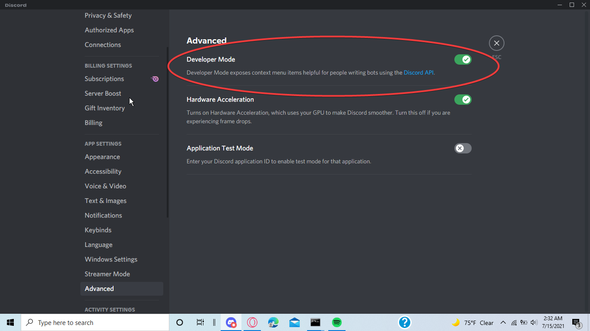

=========
Frequently Asked Questions
=========

.. note:: More questions may be added depending on how frequently they are asked.

~~~~~~~~~~~~~~
Q: I want to suggest a feature for the bot. How can I do this?
~~~~~~~~~~~~~~

A: Go to the discord(under the support section of the wiki) or create an issue on this repository

~~~~~~~~~~~~~~
Q: The bot is down, when will it be back up?
~~~~~~~~~~~~~~

A: The bot shouldn't be down unless I'm adding features to it. In that case all outages are on the support server.

~~~~~~~~~~~~~~
Q: The bot is unresponsive, but is online. HELP!!!
~~~~~~~~~~~~~~

A: This may be a part on discord's end. Again all information about outages are on the support server!

~~~~~~~~~~~~~~
Q: I found a bug when using the bot. Where do I report it?
~~~~~~~~~~~~~~

A: You can report it under issues on this respiratory

~~~~~~~~~~~~~~
Q: Can I get the premium version for free?
~~~~~~~~~~~~~~

A: No, you can get premium by voting for my bot, or winning it in giveaways which are hosted on my discord servers!

~~~~~~~~~~~~~~
Q: How do I invite the premium bot?
~~~~~~~~~~~~~~

A: If you have bought it or have won it from a giveaway, you should automatically receive an invite for it, if not run ``^botaccess invite`` in the support server!

~~~~~~~~~~~~~~
Q. The premium bot is leaving my server once I invite it. Why is this?
~~~~~~~~~~~~~~

A: You must run the following command in the support server: ``^botaccess servers add <SERVERID>``

.. note:: To find your server id, right click the server name(if you have developer tools on) and click Copy ID

.. note:: To turn on developer mode go to User Settings under App Settings click Advanced then make sure that Developer Mode is turned on. 

